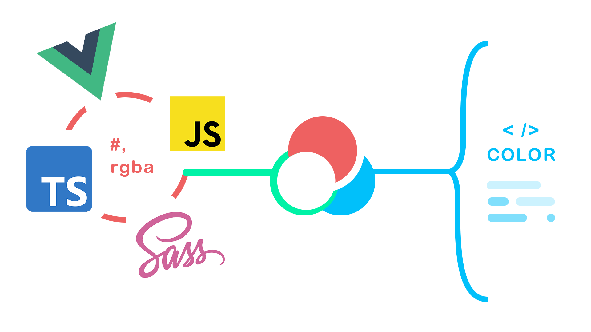

# 專案顏色管理工具

> Version: v0.0.0

用來將專案的哈希及 rgba 顏色編譯到對應的檔案裡，好統一管理顏色及加速開發這樣就不用記憶每個顏色的變量名稱，可以直接從設計稿上複製顏色再進行編譯管理。

目前支持 sass, scss, Vue<style\> 及 t/js(含 styleComponent) 編譯。

此為試驗性質的練習專案，可能蘊藏 BUG，建議 Commit 完檔案後再行編譯。

- **使用的技術有：**
    - **前台** Vue 全家桶  
    - **後台** Express + Typescript

---

## 專案啟動  

> build 啟動恐有問題，建議 dev 啟動

### 首次啟動需要 build 打包

1. git clone https://github.com/frank575/project-color-compiler.git
2. cd project-color-compiler
3. npm run build

### 非首次啟動

1. 進入 dist 資料夾點擊 start.sh 啟動

---

## 功能介紹

### 新增專案

新增需要進行編譯的專案，格式介紹  

- **專案名稱** 專案名稱
- **專案路徑** 專案的跟路徑或是專案的 src 下
- **編譯路徑** 將顏色取出歸類的檔案路徑
- **編譯檔案** 編譯的檔案名稱及類型
- **查找類型** 
    - 編譯檔案類型為 scss：可以查找 scss, sass, vue 的 style 標籤
    - 編譯檔案類型為 js：可以查找 js, ts 檔案
- **自動導入** 是否在每個被編譯的檔案裡引入顏色路徑，如果有全局引入的話可以選擇"否"
- **檔案過濾** `尚未實現` ，用來過濾檔案(通常用於過濾已經定義好的檔案，或是格式不符編譯檔案的檔案) 

### 交叉編譯

編譯 `專案路徑` 下的所有符合查找類型的檔案，並將顏色抽取出來存放在編譯檔案裡，預設的顏色變量名稱為 20 字的隨機碼

### 轉換變量與顏色

可以查看編譯檔案裡存放的所有顏色，並且可以通過 GUI 調整變量名稱、顏色及新增註解

### 匯入匯出

用來備份及導入專案數據

---

## 更新紀錄

> v0.0.0 以上版本才有更新紀錄
